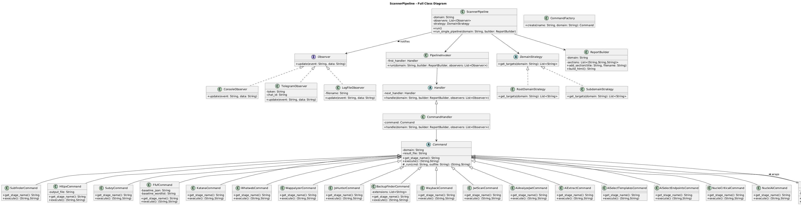
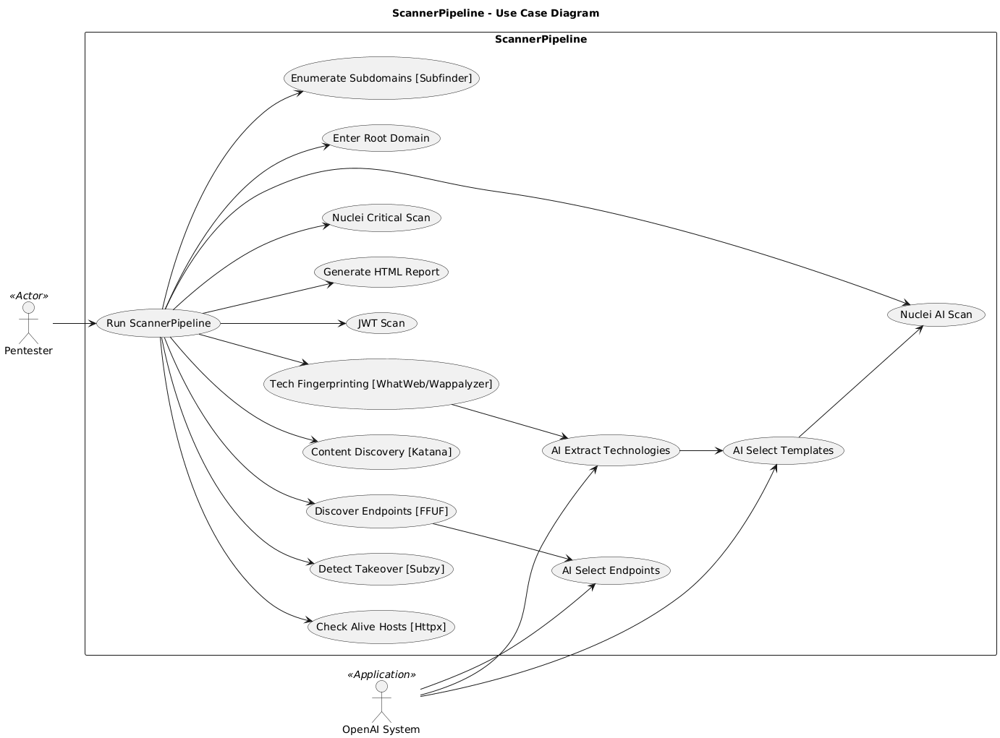
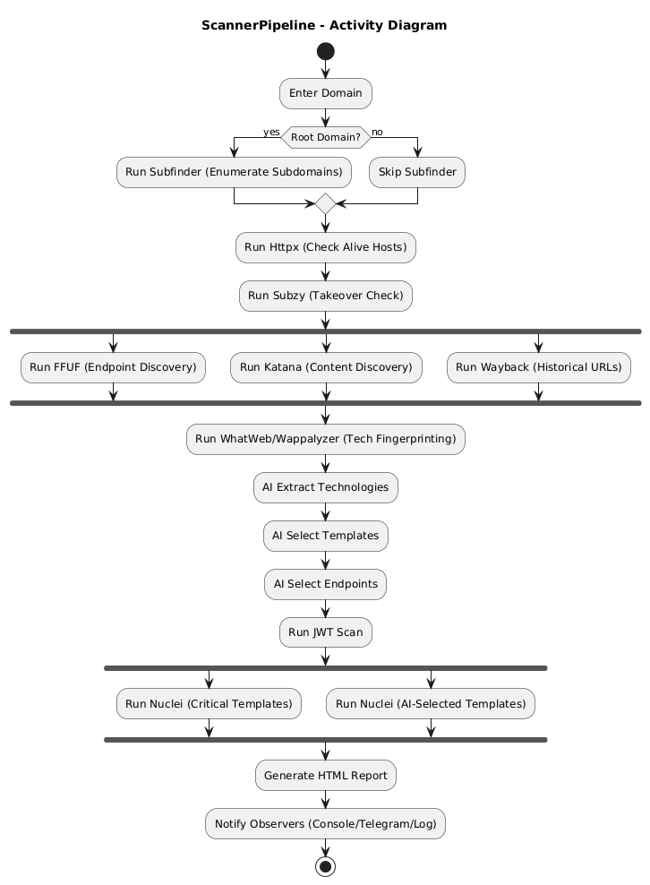

# 🔎 AI-Assisted Web Security Scanner

A modular, pattern-driven **web application security scanner pipeline** built in Python.  

- It integrates well-known reconnaissance & vulnerability discovery tools with **AI assistance** for smarter endpoint filtering and template selection.

> My project is not just a security scanner, it is also an **educational showcase of Software Design Patterns in action**.  

> Each scanning step (subdomain discovery, alive probing, endpoint fuzzing, vulnerability scanning, reporting) is modeled using **classic OOP design patterns** such as **Observer, Command, Decorator, Strategy, Factory Method, and Builder**.  

> 🎯 For security researchers: it provides an automated, AI-assisted pipeline for reconnaissance and vulnerability discovery.  
> 📚 For software engineers: it demonstrates how design patterns can be applied to build a clean, extensible, and maintainable architecture in real-world security tooling.

## 🚀 Features

- **Design Patterns in Action**
  - **Observer** → Real-time console, log, and Telegram notifications
  - **Command** → Encapsulated execution of each tool
  - **Decorator** → Timing wrapper for performance measurement
  - **Strategy** → Root vs Subdomain workflow selection
  - **Factory Method** → Dynamic command creation from identifiers
  - **Builder** → Full HTML security report generator

- **Integrated Tools**
  - 🔹 [Subfinder](https://github.com/projectdiscovery/subfinder) – Subdomain enumeration  
  - 🔹 [Httpx](https://github.com/projectdiscovery/httpx) – Live host probing  
  - 🔹 [Subzy](https://github.com/PentestPad/subzy) – Subdomain takeover detection  
  - 🔹 [FFUF](https://github.com/ffuf/ffuf) – Endpoint brute-forcing with baseline filtering  
  - 🔹 [Katana](https://github.com/projectdiscovery/katana) – Web crawling  
  - 🔹 [WhatWeb](https://github.com/urbanadventurer/whatweb) + [Wappalyzer](https://github.com/projectdiscovery/wappalyzer) – Technology detection  
  - 🔹 [Waybackurls](https://github.com/tomnomnom/waybackurls) – Passive recon via historical URLs  
  - 🔹 [Nuclei](https://github.com/projectdiscovery/nuclei) – Vulnerability scanning with AI-assisted template selection  

- **AI-Powered Modules**
  - Extract detected technologies (WhatWeb + Wappalyzer + heuristics)  
  - Select relevant **Nuclei templates** for the target tech stack  
  - Identify **suspicious endpoints** (e.g., `/admin`, `/login`, `/upload`, `.git`, `.env`)  
  - Focus on **high/critical severity scans**  

- **Output**
  - Clean HTML report including:
    - Executive summary  
    - Technology stack  
    - Vulnerability statistics  
    - Subdomain takeover results  
    - FFUF & Wayback endpoints  
    - Nuclei findings (overview + collapsible details)  

## 📐 Software Design Patterns

This project doubles as a **showcase of classic OOP design patterns** applied to a real-world security pipeline.  
It demonstrates how design patterns improve **modularity, extensibility, and maintainability**.

| Pattern           | Implementation Example                                                  | Purpose                                                                 |
|-------------------|-------------------------------------------------------------------------|-------------------------------------------------------------------------|
| **Observer**      | `ConsoleObserver`, `LogFileObserver`, `TelegramObserver`                | Notify multiple listeners (console, file, Telegram) when a command finishes. |
| **Command**       | `SubfinderCommand`, `HttpxCommand`, `FfufCommand`, `NucleiCommand`      | Encapsulate each security tool as a reusable, executable object.        |
| **Decorator**     | `TimingDecorator`                                                       | Add execution time measurement without changing the command logic.      |
| **Strategy**      | `RootDomainStrategy`, `SubdomainStrategy`                               | Switch workflows depending on input type (root vs subdomain).           |
| **Factory Method**| `CommandFactory`                                                        | Dynamically create the correct command class from a string identifier.  |
| **Builder**       | `ReportBuilder`                                                         | Assemble findings and outputs into a final HTML report.                 |

## 📐 UML Diagrams

### Class Diagram
Shows how **design patterns** (Command, Observer, Builder, etc.) are structured in the scanner pipeline.



---

### Use Case Diagram
Illustrates how the **user interacts** with the scanner system.



---

### Activity Diagram
Represents the **workflow of a scanning process** (subdomain discovery → probing → fuzzing → vulnerability scan → report).



👉 Full-size UML diagrams are available in [uml](./uml_diagrams/).

## 📂 Project Structure
```bash
├── scanner.py           # Main pipeline orchestrator
├── report-<domain>.html # Generated HTML report
├── *.json / *.txt       # Intermediate scan outputs
└── pipeline.log         # Logs
```

```bash
python3 scanner.py --domain example.com
```

- Input: Root domain (e.g. example.com) or single subdomain (e.g. app.example.com)

- Output: report-example.com.html

## 📊 Example Report

- Executive summary with severity counts  
- Detected technologies (AI-enriched)  
- Live endpoints from FFUF & Wayback  
- Vulnerability details (collapsible cards per finding) 

## 🔧 Requirements

- Python 3.10+  
- Installed tools:  
  `subfinder`, `httpx`, `subzy`, `ffuf`, `katana`, `whatweb`, `wappalyzer`, `waybackurls`, `nuclei`  
- API key for [OpenAI](https://platform.openai.com/)  

Install Python dependencies:  

```bash
pip install -r requirements.txt
```
## 📜 License
MIT License – free to use & modify.

## 🙌 Credits
Developed by **Onurcan Genç**  
Offensive Security Specialist | Bilkent CTIS  

